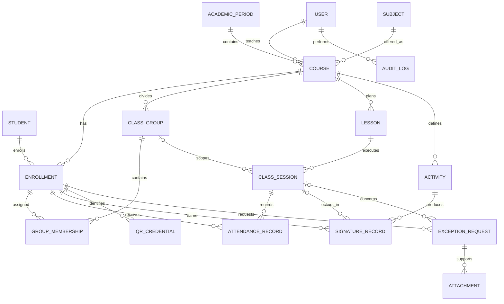

# 02. Modelo entidad-relación

## Diagrama general

## Decisiones del modelo

### Curso e inscripción

`courses` representa una materia impartida en un periodo y paralelo. `enrollments` contiene la lista oficial. No se crean inscripciones adicionales por cada laboratorio.

### Grupo y membresía

`class_groups` define subdivisiones operativas. `group_memberships` conserva vigencia mediante `assigned_at` y `removed_at`, permitiendo reconstruir a qué grupo pertenecía un estudiante en una fecha.

### Clase y sesión

`lessons` es la unidad académica común. `class_sessions` es cada ejecución real. Dos sesiones de laboratorio pueden compartir la misma clase planificada y pertenecer a grupos distintos.

### Firmas

`signature_records` registra cada incremento o ajuste. El total válido se obtiene sumando `quantity` donde `canceled_at IS NULL`.

### Asistencia

`attendance_records` registra el estado original y el estado efectivo. Esto permite aprobar una justificación sin perder el dato registrado inicialmente.

### Excepciones

`exception_requests` unifica solicitudes y autorizaciones especiales. Una excepción puede vincularse con una sesión, actividad, asistencia o firma según el caso.

## Catálogo de entidades

| Entidad | Responsabilidad |
|---|---|
| `users` | Docentes, auxiliares y administradores |
| `academic_periods` | Semestres o periodos |
| `subjects` | Catálogo de materias |
| `courses` | Materia impartida por periodo y paralelo |
| `students` | Identidad estable del estudiante |
| `enrollments` | Inscripción oficial en un curso |
| `class_groups` | Subdivisiones internas del curso |
| `group_memberships` | Historial de asignación a grupos |
| `lessons` | Clase o laboratorio planificado |
| `class_sessions` | Ejecución real por fecha y grupo |
| `activities` | Práctica, tarea o actividad evaluable |
| `attendance_records` | Asistencia por sesión |
| `signature_records` | Movimientos de firmas |
| `qr_credentials` | Credenciales QR revocables |
| `exception_requests` | Justificaciones y recuperaciones |
| `attachments` | Evidencias de excepciones |
| `audit_logs` | Historial técnico de cambios |
| `sync_operations` | Control de idempotencia offline |

## Restricciones críticas

- `UNIQUE(course_id, student_id)` en inscripciones.
- `UNIQUE(class_session_id, enrollment_id)` en asistencia.
- `UNIQUE(enrollment_id, version)` en credenciales QR.
- Una membresía activa no se elimina; se cierra con `removed_at`.
- Las firmas se anulan, no se eliminan.
- Los tokens QR se almacenan como hash.
- Las operaciones offline usan `client_operation_id` único.

## Vistas calculadas recomendadas

### `v_signature_totals`

Total de firmas válidas por estudiante y actividad.

### `v_attendance_effective`

Estado efectivo de asistencia por estudiante y sesión.

### `v_course_student_summary`

Resumen consolidado por curso con firmas, asistencias, retrasos, ausencias y justificaciones.

## Índices clave

- Búsqueda por código y nombre de estudiante.
- Inscripciones por curso.
- Miembros activos por grupo.
- Sesiones por curso y fecha.
- Firmas por actividad e inscripción.
- Asistencia por sesión.
- Excepciones pendientes por curso.
- Auditoría por entidad y fecha.

