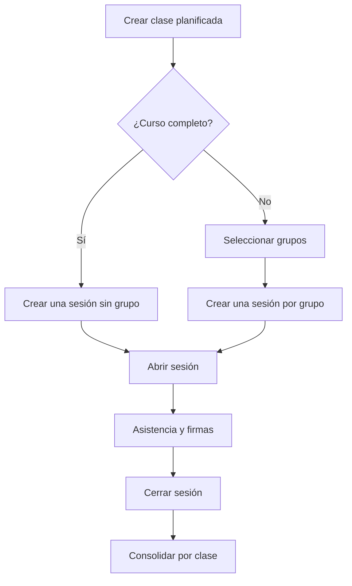

# 03. Flujos del sistema

## 1. Configuración inicial

1. La docente inicia sesión.
2. Crea o activa un periodo académico.
3. Selecciona una materia existente o crea una nueva.
4. Crea el curso indicando paralelo y horarios.
5. Importa estudiantes desde CSV/XLSX o los registra manualmente.
6. El sistema crea una inscripción única para cada estudiante.
7. Genera las credenciales QR.

## 2. División de un laboratorio

1. La docente abre el curso.
2. Crea los grupos `LAB-1` y `LAB-2`.
3. Selecciona distribución manual o equilibrada.
4. Revisa estudiantes sin grupo y duplicidades.
5. Confirma la distribución.
6. El sistema crea membresías sin modificar las inscripciones.

## 3. Planificación y ejecución de clase

La docente crea una sola clase académica y define cómo se ejecutará. El sistema crea las sesiones necesarias sin duplicar la actividad.

## 4. Registro de firma mediante QR

1. La docente abre una sesión.
2. Selecciona la actividad vinculada.
3. Activa el modo `Registrar firma`.
4. Escanea el QR.
5. El sistema valida:
   - Usuario autenticado y autorizado.
   - QR vigente.
   - Inscripción activa en el curso.
   - Actividad abierta.
   - Máximo de firmas.
   - Lectura duplicada reciente.
   - Correspondencia con el grupo.
6. Si todo es válido, crea el movimiento.
7. Muestra nombre, fotografía, total y confirmación visual/sonora.

### Estudiante de otro grupo

El sistema advierte la diferencia y permite:

- Cancelar.
- Registrar como recuperación.
- Registrar visita excepcional.
- Solicitar autorización.

La elección queda asociada a una excepción auditable.

## 5. Toma de asistencia

1. La docente abre la sesión.
2. El sistema carga los estudiantes esperados.
3. Registra cada entrada por QR o marcado manual.
4. Calcula presente o retraso según la tolerancia.
5. La docente revisa casos especiales.
6. Al cerrar, el sistema propone marcar como ausentes a quienes no tienen registro.
7. La docente confirma el cierre.

## 6. Justificación de ausencia

1. Se selecciona la ausencia.
2. Se crea una solicitud de tipo `ABSENCE_JUSTIFICATION`.
3. Se registra el motivo y se adjunta evidencia opcional.
4. La solicitud queda pendiente.
5. La docente aprueba, rechaza o solicita corrección.
6. Al aprobar, el estado efectivo pasa a `JUSTIFIED`.
7. El estado original y la resolución quedan conservados.

## 7. Recuperación

1. La docente abre la actividad pendiente.
2. Selecciona estudiante y sesión de recuperación.
3. El sistema detecta que la sesión no corresponde al grupo oficial.
4. La docente registra motivo y autorización.
5. Se crea la excepción.
6. Se registra asistencia y/o firma vinculada a esa excepción.
7. El reporte consolida el resultado una sola vez.

## 8. Cambio de grupo

1. La docente selecciona al estudiante.
2. Cierra la membresía actual con fecha efectiva.
3. Crea la nueva membresía.
4. Las sesiones futuras usan el grupo nuevo.
5. Los registros históricos siguen vinculados a las sesiones anteriores.

## 9. Operación sin conexión

1. La PWA detecta la pérdida de red.
2. Permite operar únicamente sobre cursos y sesiones descargados previamente.
3. Cada acción recibe un `client_operation_id`.
4. La acción se guarda cifrada localmente.
5. Al recuperar conexión, la cola se envía en orden.
6. El servidor valida autorización, vigencia y duplicados.
7. El cliente marca la acción como sincronizada o muestra un conflicto.

No se aceptará silenciosamente una operación que viole reglas actuales del servidor.

## 10. Cierre y reportes

1. La docente revisa sesiones abiertas y excepciones pendientes.
2. Cierra actividades.
3. Consulta vista por grupo o consolidada.
4. Corrige mediante anulaciones o excepciones justificadas.
5. Exporta Excel/PDF.
6. Cierra el curso o periodo para evitar cambios ordinarios.

