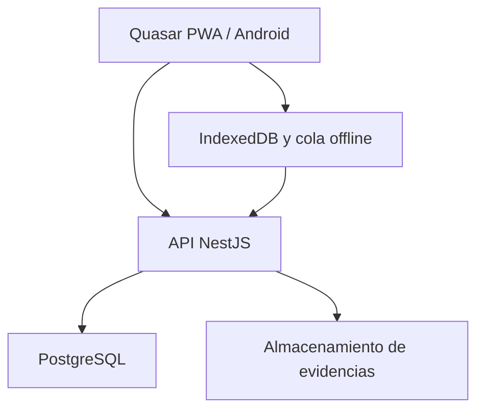

# 04. Arquitectura técnica

## Stack

| Capa | Tecnología |
|---|---|
| Aplicación | Vue 3 + TypeScript |
| Framework UI | Quasar |
| Estado | Pinia |
| Rutas | Vue Router |
| Validación | Zod |
| HTTP | Axios |
| PWA | Quasar PWA + Workbox |
| Android | Capacitor |
| Datos offline | IndexedDB + Dexie |
| API | NestJS |
| Persistencia | PostgreSQL |
| ORM sugerido | Drizzle ORM |
| API docs | OpenAPI/Swagger |
| Archivos | Almacenamiento compatible con S3 |

## Arquitectura



## Estructura propuesta

```text
apps/
├── docente-app/
│   ├── src/
│   │   ├── boot/
│   │   ├── components/
│   │   ├── layouts/
│   │   ├── modules/
│   │   │   ├── auth/
│   │   │   ├── courses/
│   │   │   ├── students/
│   │   │   ├── groups/
│   │   │   ├── sessions/
│   │   │   ├── attendance/
│   │   │   ├── signatures/
│   │   │   ├── exceptions/
│   │   │   └── reports/
│   │   ├── offline/
│   │   ├── pages/
│   │   ├── router/
│   │   ├── services/
│   │   └── stores/
│   ├── src-capacitor/
│   └── src-pwa/
└── api/
    └── src/
        ├── common/
        ├── auth/
        ├── academic-periods/
        ├── subjects/
        ├── courses/
        ├── students/
        ├── groups/
        ├── lessons/
        ├── attendance/
        ├── signatures/
        ├── exceptions/
        ├── reports/
        ├── audit/
        └── sync/
```

## API por módulos

| Módulo | Operaciones principales |
|---|---|
| Auth | Login, refresh, cierre de sesión, perfil |
| Courses | CRUD de periodos, materias y cursos |
| Students | CRUD, importación y búsqueda |
| Enrollments | Inscribir, retirar y generar QR |
| Groups | Crear, distribuir y cambiar miembros |
| Lessons | Planificar clases y crear sesiones |
| Attendance | Check-in, corrección y cierre |
| Signatures | Registrar, listar y anular |
| Exceptions | Solicitar, adjuntar, resolver |
| Reports | Consolidado, por grupo y exportación |
| Sync | Recibir lotes idempotentes offline |

## Seguridad

- Contraseñas con Argon2id.
- Tokens de acceso cortos y refresh token rotatorio.
- Roles y permisos por curso.
- Rate limiting en autenticación y escaneo.
- Tokens QR aleatorios de alta entropía almacenados como hash.
- Evidencias privadas mediante URL firmada.
- Auditoría de acciones sensibles.
- Validación estricta de entrada.
- CORS limitado a los orígenes desplegados.

## Estrategia offline

La PWA almacenará:

- Perfil mínimo del usuario.
- Cursos habilitados para trabajo offline.
- Sesiones del día.
- Estudiantes e imágenes reducidas necesarias.
- Hash o referencia segura para resolver QR.
- Cola de operaciones pendientes.

No almacenará contraseñas ni tokens QR en texto plano. La cola debe ser idempotente y tener estados `PENDING`, `SYNCING`, `SYNCED`, `CONFLICT` y `FAILED`.

## Consistencia

- El servidor es la fuente de verdad.
- Cada operación offline lleva UUID generado por cliente.
- El servidor retorna el resultado previo si recibe el mismo UUID.
- Firmas y anulaciones se ejecutan en transacciones.
- El cierre de sesión bloquea cambios ordinarios posteriores.
- Los totales se calculan desde registros válidos o vistas materializadas, nunca desde un contador manual.

## Observabilidad

- Logs estructurados con `request_id`.
- Registro de dispositivo y versión de aplicación.
- Métricas de escaneos válidos, rechazados y sincronizaciones.
- Alertas por errores repetidos de sincronización.
- Auditoría separada de logs técnicos.

## Estrategia de pruebas

- Unitarias: reglas de máximo, grupos, asistencia y excepciones.
- Integración: repositorios y transacciones PostgreSQL.
- API: autorización, idempotencia y conflictos.
- Frontend: stores, formularios y estados offline.
- E2E: crear curso, dividir grupos, escanear, justificar y exportar.

