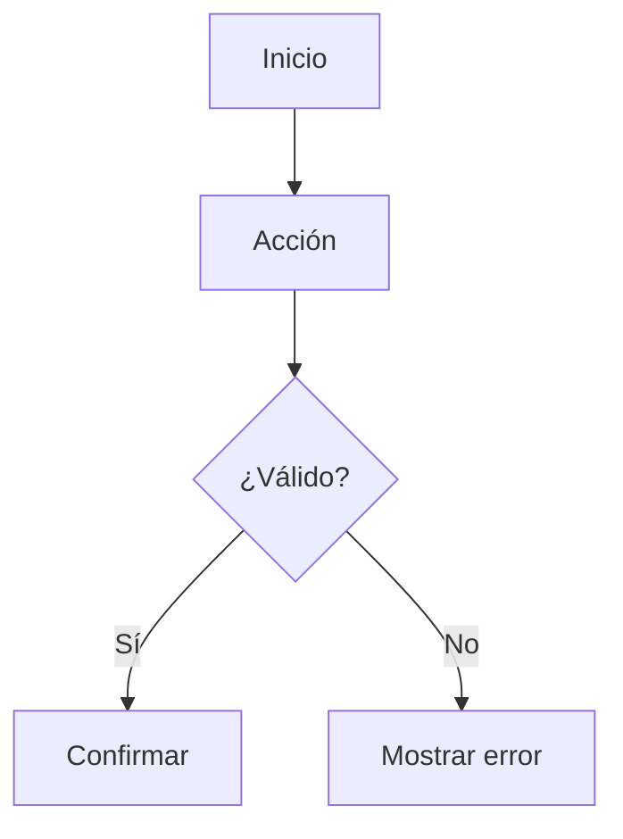

# Flujo: [nombre]

## Objetivo

[Resultado de negocio.]

## Actor principal

[Actor.]

## Precondiciones

- [Condición.]

## Disparador

[Evento inicial.]

## Flujo principal

1. [Paso.]
2. [Paso.]
3. [Paso.]

## Decisiones

| Condición | Resultado |
|---|---|
| [Condición] | [Camino] |

## Excepciones

### [Código]: [nombre]

- Causa: [causa].
- Mensaje: [mensaje para el usuario].
- Recuperación: [acción].
- Auditoría: [evento].

## Resultado final

- Entidades creadas/modificadas: [lista].
- Notificación: [si aplica].
- Estado offline: [si aplica].

## Diagrama

## Criterios de aceptación

- [ ] [Criterio verificable.]

